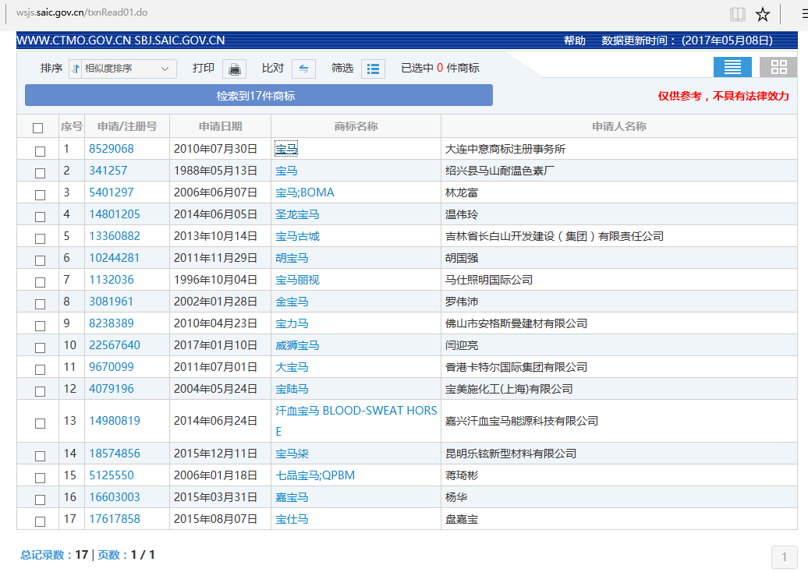

# 具体需求  

### 页面一   

1. 输入商标名称
2. 遍历 国际分类编号: 1-45类，所以需要根据商标名称进行搜索 **45**次

> ex :输入国际分类：2   商标名称 ：宝马

---

### 页面二——点击***查询***后进入  

* 抓取数据项

1. 申请注册号
2. 申请日期
3. 商标名称

> 此处可使用python 操作 excel 表格   

  

---

### 页面三——点击*商标名称*进入

* 抓取数据项为页面所显示的**所有表单信息**

---

### 页面四——点击***商标流程***进入  

* 抓取的数据项为

  1. 申请/注册号
  2. 业务名称
  3. 环节名称
  4. 结论
  5. 日期

  